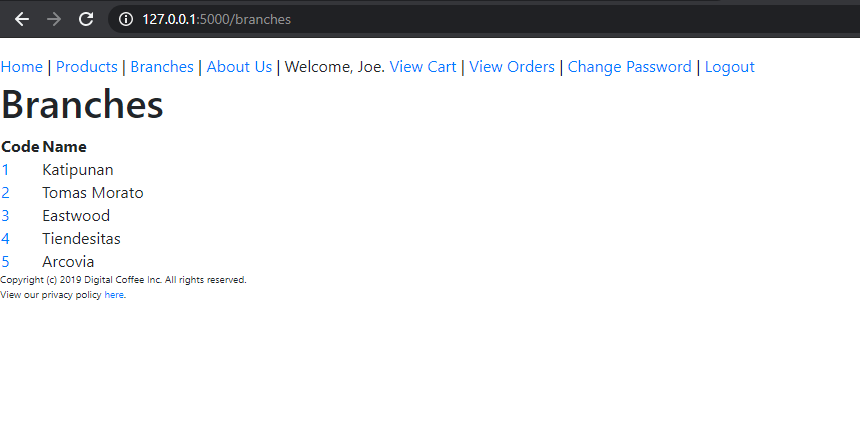

# Digital Cafe

Digital Cafe is a simple flask exercise for our ITMGT 45 class.

## Home Page

## Products Page

## Product Details Page

## Branches Page

## Cart Page

## Product API

## Branches DB

## View Orders

## Update, Delete Item, Delete All

## Change Password

